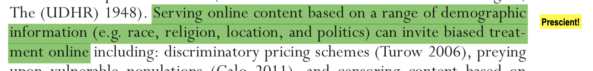
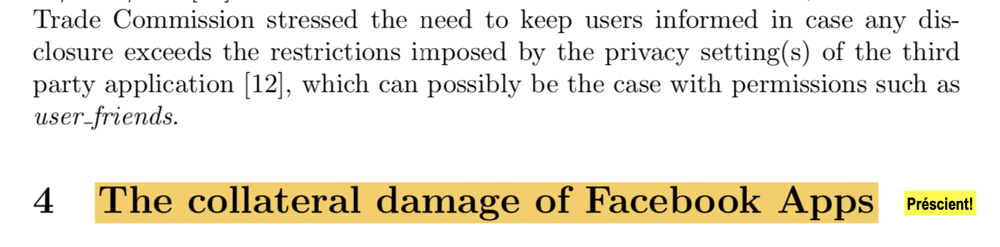
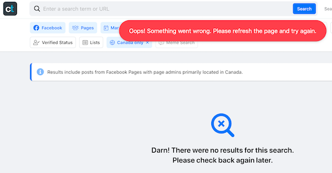
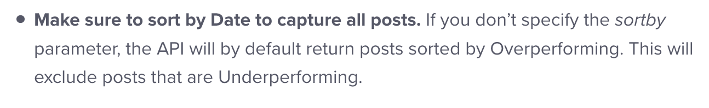
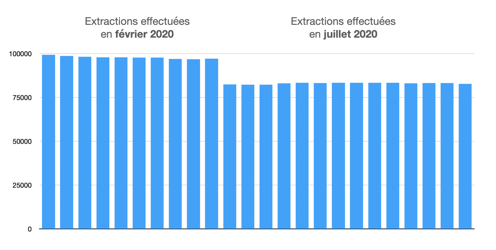
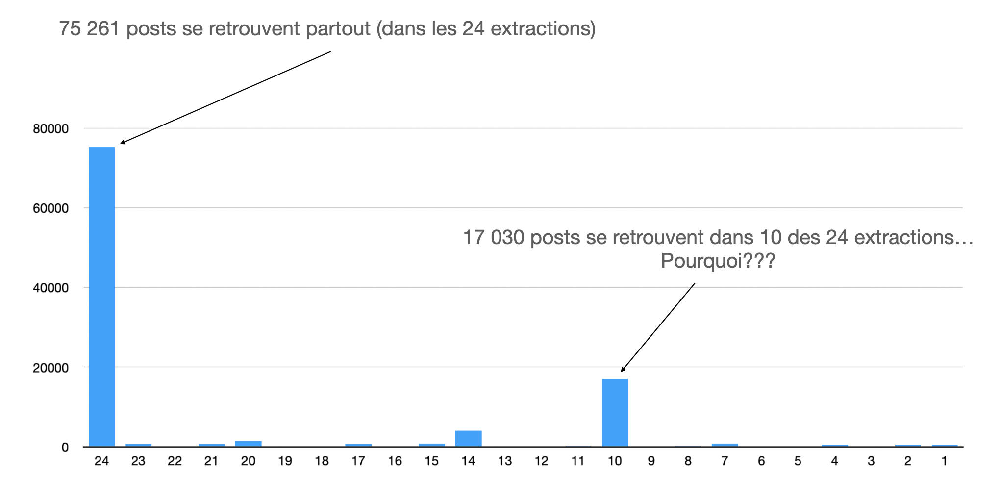
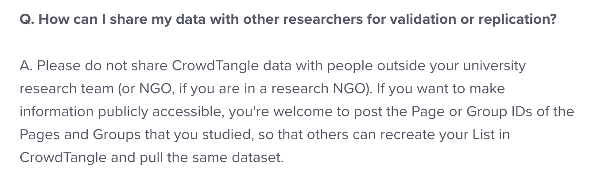
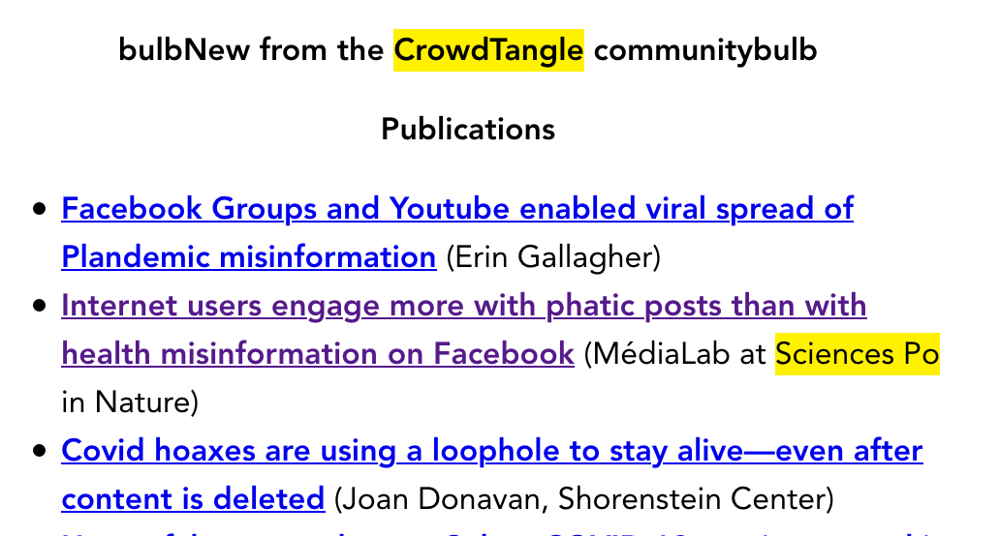
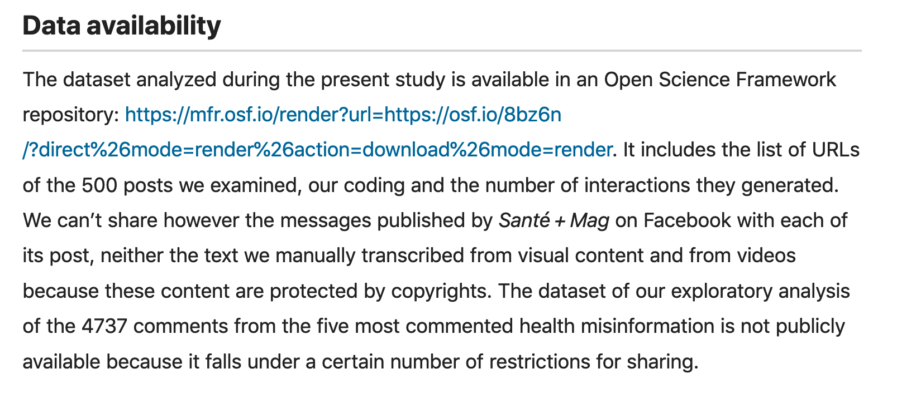
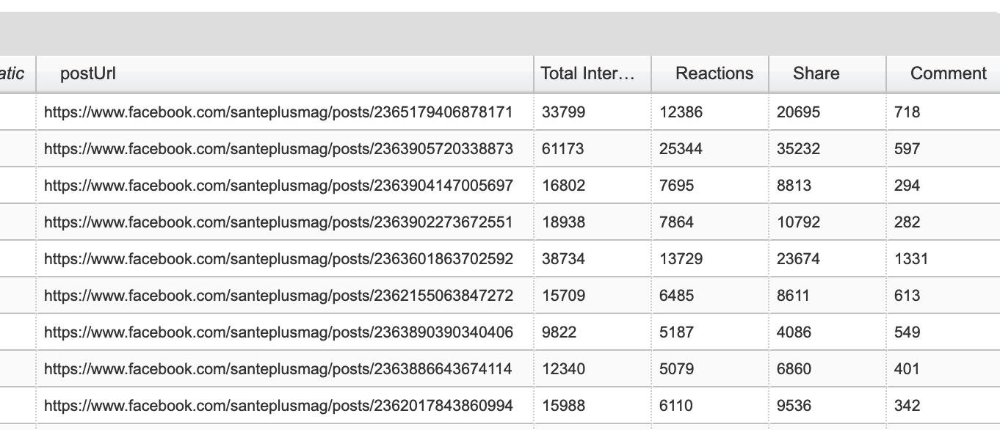

# midiBIN_CrowdTangle (18 février 2021)

### Avant -> GraphAPI

- [GraphAPI](https://developers.facebook.com/tools/explorer/) (existe toujours, mais est plus difficile d'accès)

- Des chercheurs ont prévenu qu'il y avait des problèmes pour la vie privée



- [Bodle, R. (2011). Regimes of Sharing. Information, Communication & Society, 14(3), 320‑337](https://doi.org/10.1080/1369118X.2010.542825).



- [Symeonidis, I., Tsormpatzoudi, P. et Preneel, B. (2015). Collateral damage of Facebook Apps: an enhanced privacy scoring model. Dans IACR Cryptology EPrint Archive](https://eprint.iacr.org/2015/456.pdf).

- Résultat: le «meltdown» [**Cambridge Analytica**](https://www.economist.com/leaders/2018/03/22/facebook-faces-a-reputational-meltdown)


### CrowdTangle

- Créé en 2015 ([brevet](https://patents.google.com/patent/US20150169587A1/en?inventor=Brandon+Ashley+Silverman&assignee=Openpage+Labs+Inc.+d%2fb%2fa+CrowdTangle))

- Acquis par Facebook en 2016.

- Accessible à chercheuses.eurs dans le cadre du partenariat [**Social Science One** de Harvard](https://socialscience.one/partnerships)

- Prend trois formes:

  1. [**Extension chrome**](https://chrome.google.com/webstore/detail/crowdtangle-link-checker/klakndphagmmfkpelfkgjbkimjihpmkh)

      - exemple avec [texte d'opinion dans *Le Devoir*](https://www.ledevoir.com/opinion/idees/594650/qu-est-ce-qu-une-universite)
  
  2. [**Tableau de bord**](https://www.crowdtangle.com/) (ou *dashboard*)

      - Se créer des listes et les *manage*. Exemple avec [Valnet](https://www.valnetinc.com/)
        - [Pages Facebook](fichiers/listePages.csv)
        - [Comptes Instagram](fichiers/comptesInsta.csv)
      
      - Explorer ces listes. Exemple avec IIJ:
        - [First Nations Pages](https://apps.crowdtangle.com/iij/lists/1347336)
        - [First Nations Groups](https://apps.crowdtangle.com/iij/lists/1388572)
      
      - *Historical search*

      - [*Search*](https://apps.crowdtangle.com/search/results)
        - Avec autres réseaux: Insta, Reddit, Twitter.
        - Changements dans les fonctionnalités:
          - En 2020, retournait **30 000** résultats
          - En janvier 2021, ne retournait plus que **10 000** résultats
          - Depuis quelques jours, retourne **300 000** résultats
     
        - Copier l'URL d'une requête si vous en faites plusieurs.

        - Exemple: tout le FB belge en janvier 2020 (pour avoir février, il suffirait de changer les champs `customStartDate`, `customEndDate`, `customChartStartDate` et `customChartEndDate`):

          [`https://apps.crowdtangle.com/search/results?includedCountries=BE&customStartDate=2020-01-01T00:00:00&customEndDate=2020-02-01T00:00:00&customChartStartDate=2020-01-01T00:00:00&customChartEndDate=2020-02-01T00:00:00&platform=facebook&postTypes=&producerTypes=3&q=&sortBy=score&sortOrder=desc&timeframe=custom`](https://apps.crowdtangle.com/search/results?includedCountries=BE&customStartDate=2020-01-01T00:00:00&customEndDate=2020-02-01T00:00:00&customChartStartDate=2020-01-01T00:00:00&customChartEndDate=2020-02-01T00:00:00&platform=facebook&postTypes=&producerTypes=3&q=&sortBy=score&sortOrder=desc&timeframe=custom)
          
        - Ça peut être long...
          
        

  
  3. [API](https://github.com/CrowdTangle/API/wiki)

      - Pour une utilisation programmatique. Avec la fonction *search*, ci-dessus, qui permet de retourner 300 000 posts, ce n'est plus guère nécessaire, sinon pour mettre sur pied une veille ou pour aller chercher davantage de posts...

      - Nécessite l'utilisation d'un **jeton** (*API token*). Chaque jeton est associé à un tableau de bord.

        - Limites:

          - 100 posts à la fois (pallier avec la pagination)
          - 6 appels à la minute seulement! (mettre des *sleep* de 10 secondes dans vos scripts 😱)

      - *endpoint* `posts`

        Permet d'aller chercher tous les posts d'une liste donnée, préalablement préparée dans un tableau de bord.
        
        Exemple avec l'une des listes vues plus haut, **First nations pages** qui regroupe plus de 800 pages. Son numéro est *1347336*. Avec le jeton, ce numéro permet de construire un appel à l'API de CrowdTangle. Voici un exemple. [Cette liste de posts mentionnant la Covid-19 dans les pages ou groupes Facebook autochtones](http://bit.ly/covidIIJ) est peuplée automatiquement par des appels simples comme celui-ci (pour les pages; un autre appel doit être fait pour les groupes):
        
        `https://api.crowdtangle.com/posts?token={votreToken}&listIds=1347336&count=100`
        
        Va retourner quelque chose comme ceci:
        
        ```json
        {
          "platformId": "1834379636802508_2818911758349286",
          "platform": "Facebook",
          "date": "2021-02-18 00:22:24",
          "updated": "2021-02-18 03:12:23",
          "type": "photo",
          "message": "COMMUNIQUÉ DE PRESSE POUR DIFFUSION IMMÉDIATE FINANCEMENT MAJEUR VISANT À CONTRER LA CRISE DU LOGEMENT À UASHAT MAK MANI-UTENAM 200 unités sur une période de 5 ans",
          "expandedLinks": [
            {
              "original": "https://www.facebook.com/1834379636802508/photos/a.2216093811964420/2818911728349289/?type=3",
              "expanded": "https://www.facebook.com/1834379636802508/photos/a.2216093811964420/2818911728349289/?type=3"
            }
          ],
          "link": "https://www.facebook.com/1834379636802508/photos/a.2216093811964420/2818911728349289/?type=3",
          "postUrl": "https://www.facebook.com/1834379636802508/posts/2818911758349286",
          "subscriberCount": 3793,
          "score": 2.473684210526316,
          "media": [
            {
              "type": "photo",
              "url": "https://scontent-sjc3-1.xx.fbcdn.net/v/t1.0-9/s720x720/151623426_2818911731682622_6907612249238609571_o.jpg?_nc_cat=103&ccb=3&_nc_sid=110474&_nc_ohc=VILGJD8JktEAX8r9hYy&_nc_ht=scontent-sjc3-1.xx&tp=7&oh=6ad7f48fef65876da74e7c9ce731c7e8&oe=6054D1D7",
              "height": 720,
              "width": 437,
              "full": "https://scontent-sjc3-1.xx.fbcdn.net/v/t1.0-9/s720x720/151623426_2818911731682622_6907612249238609571_o.jpg?_nc_cat=103&ccb=3&_nc_sid=110474&_nc_ohc=VILGJD8JktEAX8r9hYy&_nc_ht=scontent-sjc3-1.xx&tp=7&oh=6ad7f48fef65876da74e7c9ce731c7e8&oe=6054D1D7"
            }
          ],
          "statistics": {
            "actual": {
              "likeCount": 10,
              "shareCount": 32,
              "commentCount": 0,
              "loveCount": 5,
              "wowCount": 0,
              "hahaCount": 0,
              "sadCount": 0,
              "angryCount": 0,
              "thankfulCount": 0,
              "careCount": 0
            },
            "expected": {
              "likeCount": 2,
              "shareCount": 5,
              "commentCount": 3,
              "loveCount": 4,
              "wowCount": 1,
              "hahaCount": 1,
              "sadCount": 1,
              "angryCount": 0,
              "thankfulCount": 0,
              "careCount": 1
            }
          },
          "account": {
            "id": 9967332,
            "name": "Innu Takuaikan Uashat mak Mani-utenam",
            "handle": "",
            "profileImage": "https://scontent-sjc3-1.xx.fbcdn.net/v/t1.0-1/p200x200/86354059_2510106442563154_6755911830654156800_n.jpg?_nc_cat=108&ccb=3&_nc_sid=dbb9e7&_nc_ohc=khZ1jhwWt8sAX9aINO0&_nc_ht=scontent-sjc3-1.xx&tp=6&oh=e8df41743550947de48e59df4d8b832a&oe=6052C47B",
            "subscriberCount": 3617,
            "url": "https://www.facebook.com/1834379636802508",
            "platform": "Facebook",
            "platformId": "1834379636802508",
            "accountType": "facebook_page",
            "pageAdminTopCountry": "CA",
            "verified": false
          },
          "imageText": "Bureau politique dotgnais I COMMUNIQUÉ PRESSE POUR DIFFUSION IMMÉDIATE FINANCEMENT MAJEUR VISANT À CONTRER CRISE DU MANI-UTENAM de 200 unités Mani-utenam, (ITUM) préliminair p abordables, une ériode Conseil l'obtention Takuaikan mak Mani- majeur pour ogements par Autochtones projet surpopulation difficulté maisons). travers besoins. des logements Canada. n permettrait parcourir besoins combler déclaré Mike Mckenzie, membres Conseil entend d'ITUM soucie pour offrir sans question travail SOURCE: Innu Uashat mak RENSEIGNEMENTS: (ITUM) Secteur communications| ITUM Téléphone:4 962-0327, poste 5315 418444-3264",
          "legacyId": 0,
          "id": "9967332|2818911758349286"
        },
        ```
        
        Attention, cependant:
        
        
        
        Autre exemple avec [une liste de politiciens dont on souhaite recueillir les plus récentes publications dans Instagram](https://apps.crowdtangle.com/eluesinsta/lists/1463906). L'appel comporte plus de paramètres, notamment `endDate` pour dire à l'API jusqu'à quelle date/heure chercher, et un `timeframe` pour dire quelle période couvrir avant cette date/heure de fin.
        
        `https://api.crowdtangle.com/posts?token={votreToken}&listIds=1463906&count=100&sortBy=date&timeframe=24%20HOUR&endDate=2021-01-16T22:00:00`

      - *endpoint* `posts/search`
       
        Accessible **sur demande seulement**! Pour des recherches sur l'ensemble du *contenu indexé par CrowdTangle* (nuance importante, plus bas), ou pour des recherches par pays.
        
        Nécessite l'utilisation d'une expression à rechercher. Pour maximiser la collecte, on peut s'inspirer de regex et faire une recherche pour «[a-b][0-9]».
        
        Exemple. Ici, on demande à CT de retourner des posts de pages administrées au Canada, publiés le 1er juillet 2020, des les ordonner par nombre d'interactions et de nous afficher du 3300e au 3399e post. 
        
        `https://api.crowdtangle.com/posts/search?token={votreToken}&startDate=2020-07-01&endDate=2020-07-02&sortBy=total_interactions&platforms=facebook&accountTypes=facebook_page&pageAdminTopCountry=CA&searchTerm=a,b,c,d,e,f,g,h,i,j,k,l,m,n,o,p,q,r,s,t,u,v,w,x,y,z,1,2,3,4,5,6,7,8,9,0&count=100&offset=3300`
          
### Autres limites

- Attention à l'illustion de la totalité.
  - Par défaut, CrowdTangle ne couvre pas TOUT Facebook.
  - Plus de 6M de pages, groupes publics et profils vérifiés de Facebook, plus de 2M de profils Instagram publics et plus de 20k des *subs* les plus actifs dans Reddit. Pour les pages, le % de couverture diminue avec le nombre d'abonnés ou de «j'aime» pour cette page.

  
  
  - Cela dit, dès lors qu'une page ou un groupe est ajouté à une liste, CT va le suivre.

- Les données de CrowdTangle ne semblent pas cohérentes.
  - En février et en juillet 2020, j'ai effectué 24 extractions rigoureusement identiques avec cette liste de [101 médias du Québec](https://apps.crowdtangle.com/mdiasduqubec/lists/1341703).
  - J'ai demandé à CT de me sortir tous les posts publiés par ces pages durant l'année 2018, une journée à la fois avec les paramètres `startDate` et `endDate`:

  ```python
  for date in listeDates:
  	date2 = date + timedelta(days=1)
  	url = "https://api.crowdtangle.com/posts?token={0}&startDate={1}-{2:02d}-{3:02d}&endDate={4}-{5:02d}-{6:02d}&listIds=1341703&count=100".format(jeton,date.year,date.month,date.day,date2.year,date2.month,date2.day)
  ```

  - CrowdTangle m'a retourné, à chaque extraction, un nombre de *posts* **différent**, entre 99&nbsp;318 et 82&nbsp;244.

  
  
  - Au final, j'avais 104&nbsp;423 posts uniques. Seulement 75&nbsp;261 se retrouvaient dans toutes les 24 extractions effectuées.

  

- Les conditions d'utilisation de CrowdTangle sont restrictives.

  
  
  - Problème pour publications qui exigent qu'on rende accessibles nos données.
  - Pourtant, dans son infolettre, CrowdTangle fait des liens vers des articles qui ont utilisé CT.

  

  - Cet article par une équipe de Sciences Po Paris est un exemple: [Berriche, M., Altay, S. Internet users engage more with phatic posts than with health misinformation on Facebook. *Palgrave Communications* 6, 71 (2020)](https://doi.org/10.1057/s41599-020-0452-1)
  - Les auteurs indiquent qu'elles partagent leurs données, mais partiellement (elles retranchent les champs textuels, par exemple, pour des raisons de copyright).

  
  
  <div style="padding:100px;"></div>
  
  - Il semble donc y avoir des solutions de rechange.

- CrowdTangle ne donne accès à aucun commentaire.

  - Si les commentaires sont votre objet de recherche, c'est mal barré.
  - Mais ici aussi, il y a des solutions de rechange. Le champ `platformId` correspond à un numéro d'identification unique d'une publication Facebook. 
  - Prenons l'exemple de celui-ci: `255561392521_10157929543417522`
  - Si on ajoute `https://www.facebook.com/` avant, on obtient [l'URL de la publication](https://www.facebook.com/255561392521_10157929543417522) (par le journal *Le Canada français*, le 31 décembre dernier).
  - On peut ensuite entrer cet URL dans un autre outil: [**Export Comments**](https://exportcomments.com/)
  - Il vous produit un [fichier xlsx un peu mal foutu](fichiers/exportcomments.xlsx), mais contenant les commentaires, le nom des personnes qui les ont rédigés et leur ID Facebook.
  - Dispose d'un API, que je n'ai jamais essayé, car il n'est [pas gratuit](https://exportcomments.com/pricing).
  - Pourrait être utilisé en complément de CrowdTangle.

### Autres ressources

- Il peut être possible de moissonner directement des pages Facebook en utilisant plutôt la version mobile d'une page. Il suffit de changer `www` par `m` dans l'URL de la page en question (ou de tout autre type de contenu sur FB).
  - Exemple: [https://www.facebook.com/leCIRST](https://www.facebook.com/leCIRST) vs [https://m.facebook.com/leCIRST](https://m.facebook.com/leCIRST)  

- Comment consulter plusieurs «pages» d'un API. Recette python d'une boucle `while`.

- [Quelles données sont couvertes par CrowdTangle](https://help.crowdtangle.com/en/articles/1140930-what-data-is-crowdtangle-tracking)
- [Academic FAQ](https://help.crowdtangle.com/en/articles/3323105-academics-researchers-faq)
- [Naomi Shiffman](nshiffman@fb.com), *Academic Lead*
